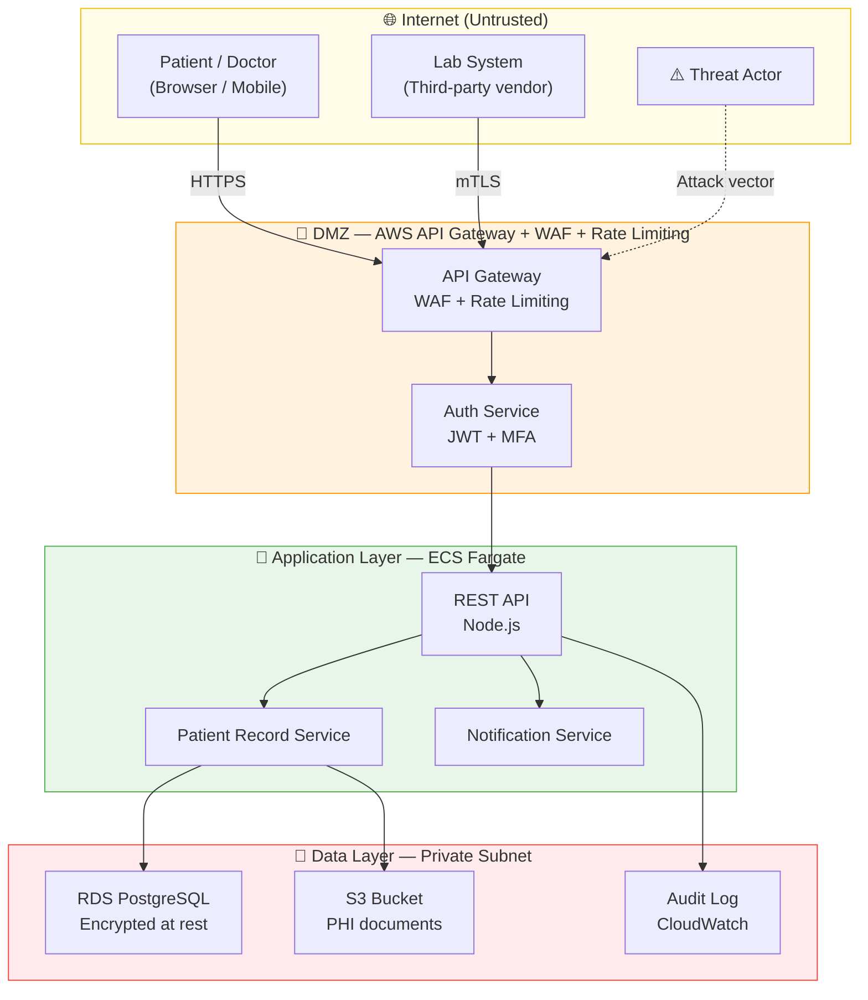

# Complete-threat-model-for-healthcare-application
Healthcare platform threat model using STRIDE, MITRE ATT&amp;CK, Cyber Kill Chain, attack trees, DREAD risk scoring, and NIST CSF control mapping. 25 threats identified across 6 categories.

# Complete Threat Model


> A **production-grade threat model** for a cloud-native healthcare application — identifying 25 threats across 6 categories, mapped to MITRE ATT&CK, scored with DREAD, and paired with a prioritised remediation roadmap. Built to demonstrate real-world security engineering applied to systems handling patient PHI under NHS DSPT and UK GDPR obligations.

---

## 📋 Table of Contents

- [Overview](#overview)
- [What Was Modelled](#what-was-modelled)
- [Methodology](#methodology)
- [Architecture](#architecture)
- [Threat Coverage](#threat-coverage)
- [Key Findings](#key-findings)
- [Attack Simulation](#attack-simulation)
- [Skills Demonstrated](#skills-demonstrated)
- [Repository Structure](#repository-structure)
- [License](#license)

---

## Overview

**Solaris Care Connect 360** is a fictional cloud-native healthcare platform built on AWS, handling appointment booking, patient records (PHI), clinical notes, and third-party lab integrations. This project delivers a complete security threat model as would be produced by a security engineer at the design phase of a real product.

This is not a theoretical exercise — every threat, attack path, and control recommendation reflects patterns observed in real healthcare breaches (Change Healthcare 2024, Anthem 2015, NHS WannaCry 2017).

**Who this is for:**
- Security engineering and DevSecOps hiring managers reviewing portfolio work
- Developers building healthcare or regulated-data applications
- Anyone learning structured threat modelling methodology

---

## What Was Modelled

| Component | Description |
|-----------|-------------|
| **Platform** | Cloud-native healthcare SaaS on AWS |
| **Data sensitivity** | Patient PHI — NHS DSPT + UK GDPR scope |
| **Users** | Patients, doctors, admins, lab integrations |
| **Infrastructure** | ECS containers, RDS PostgreSQL, API Gateway, S3, VPC |
| **Integrations** | Lab result feeds, NHS login (OAuth), email/SMS notifications |

---

## Methodology

Five industry-standard frameworks were applied in sequence:

```
Data Flow Diagram → STRIDE Analysis → MITRE ATT&CK Mapping → DREAD Scoring → Control Mapping (NIST CSF)
```

| Framework | Purpose |
|-----------|---------|
| **DFD (Data Flow Diagram)** | Map all system components, data flows, and trust boundaries |
| **STRIDE** | Categorise threats by type: Spoofing, Tampering, Repudiation, Information Disclosure, DoS, Elevation of Privilege |
| **MITRE ATT&CK** | Map each threat to real attacker tactics and techniques |
| **DREAD** | Score each threat by Damage, Reproducibility, Exploitability, Affected Users, Discoverability |
| **Cyber Kill Chain** | Model how a full attack progresses from reconnaissance to exfiltration |
| **Attack Trees** | Visualise all possible paths to each attacker goal |
| **NIST CSF** | Map controls to Identify, Protect, Detect, Respond, Recover functions |

---

## Architecture

The system modelled across four trust boundary zones:



---

## Threat Coverage

**25 threats identified** across 6 STRIDE categories:

| STRIDE Category | Threats Found | Highest DREAD Score | Status |
|----------------|:-------------:|:-------------------:|--------|
| **S** — Spoofing | 4 | 8.2 | 🟡 Partial controls |
| **T** — Tampering | 5 | 9.1 | 🔴 Gap identified |
| **R** — Repudiation | 3 | 7.4 | 🟡 Partial controls |
| **I** — Information Disclosure | 6 | 9.4 | 🔴 Critical gap |
| **D** — Denial of Service | 4 | 7.8 | 🟢 Controls in place |
| **E** — Elevation of Privilege | 3 | 8.6 | 🔴 Gap identified |

### Top 5 Critical Threats

| # | Threat | DREAD Score | MITRE Technique | Control Gap |
|---|--------|:-----------:|----------------|-------------|
| 1 | SQL Injection on patient records API | **9.4** | T1190 | No WAF deployed |
| 2 | PHI exfiltration via broken access control | **9.1** | T1530 | IDOR not fully remediated |
| 3 | Credential stuffing on patient portal | **8.8** | T1110.004 | MFA not enforced for patients |
| 4 | Insider privilege abuse — bulk export | **8.6** | T1078 | No User Behaviour Analytics |
| 5 | Ransomware via phishing → lateral movement | **8.4** | T1486 | Backups not immutable |

---

## Key Findings

### 🔴 Critical Gaps (Pre-launch blockers)

1. **No WAF deployed** — SQL injection on the patient records endpoint can dump the entire database in a single request
2. **MFA not enforced for patient accounts** — credential stuffing is the lowest-effort attack with zero technical skill required
3. **S3 Object Lock not configured** — ransomware attack can destroy backups, making recovery impossible
4. **No User Behaviour Analytics** — insider data theft is completely undetectable without a behavioural baseline

### 🟡 Significant Gaps (Fix within 30 days)

5. IDOR vulnerability allows a doctor to query records outside their assigned patient list
6. Audit logs exist but are not write-once — a sophisticated attacker can delete evidence of their access
7. Client-side RBAC checks can be bypassed by modifying API requests directly

---

## Attack Simulation

A full APT (Advanced Persistent Threat) simulation was modelled — a day-by-day timeline of how a financially motivated threat actor would steal 100,000 patient records from Solaris, from initial reconnaissance to dark web sale:

```
Day 1  → Reconnaissance: OSINT on LinkedIn, job postings, GitHub
Day 3  → Target: IT admin email identified
Day 5  → Delivery: Spearphishing email with malicious PDF macro
Day 5  → Exploitation: Reverse shell established
Day 6  → Credential harvest: VPN credentials found in email
Day 7  → Lateral movement: Database server reached
Day 8  → Exfiltration: 100,000 records exported via HTTPS
Day 9  → Cover: Logs deleted, backdoor removed
Day 30 → Discovery: Breach found during audit (21-day gap)
```

**Without controls:** 100,000 records exfiltrated, 21-day detection gap, GDPR breach notification required.

**With all recommended controls:** Attack chain broken at Day 5 (email sandbox detonates PDF macro before delivery).

Full simulation with detection point analysis is in [`reports/attack-simulation.md`](reports/attack-simulation.md).

---

## Skills Demonstrated

### Security Engineering
- **Threat Modelling (STRIDE):** Systematic identification and categorisation of 25 threats across all six STRIDE categories applied to a realistic cloud architecture
- **Risk Scoring (DREAD):** Quantitative risk scoring enabling priority-ordered remediation — the highest-scoring threat (SQLi, 9.4) was identified as a pre-launch blocker
- **Attack Tree Analysis:** Multi-path attacker goal decomposition with AND/OR node logic used to identify the lowest-effort attack path (credential stuffing, zero skill required)
- **MITRE ATT&CK Mapping:** Every threat mapped to specific ATT&CK techniques, enabling detection rule development and red team scenario planning

### DevSecOps & Secure Architecture
- **Security-by-design:** Controls recommended at the architecture stage, not as afterthoughts — demonstrating shift-left security thinking
- **NIST CSF Control Mapping:** All 25 threats mapped to NIST CSF functions (Identify, Protect, Detect, Respond, Recover) with implementation status tracked
- **Compliance Awareness:** NHS DSPT mandatory standards and UK GDPR Article 32 obligations applied throughout — breach notification timelines, data minimisation, and access control requirements all reflected in control recommendations
- **Immutable Infrastructure Security:** AWS-specific recommendations including S3 Object Lock, CloudTrail log integrity, and VPC flow log analysis

### Documentation & Communication
- **Executive-ready risk register:** DREAD-scored risk register structured for both technical teams and non-technical stakeholders
- **Cyber Kill Chain analysis:** Full kill chain documented per threat, enabling both detection engineering and incident response planning
- **APT simulation:** Realistic day-by-day attack timeline demonstrating understanding of real attacker behaviour and dwell time

---

## Repository Structure

```
Complete-threat-model-for-healthcare-application/
│
├── README.md                          # Project overview and documentation
│
├── diagrams/
│   ├── architecture.md                # System architecture and trust boundaries
│   ├── attack-trees.md                # Attack trees for all attacker goals
│   ├── dfd-level0.md                  # Level 0 Data Flow Diagram (context)
│   └── dfd-level1.md                  # Level 1 Data Flow Diagram (detail)
│
├── reports/
│   ├── solaris-layer.json             # Structured threat data (machine-readable)
│   └── threat-model-report.md         # Full consolidated threat model report
│
└── templates/
    ├── kill-chain-analysis.md         # Cyber Kill Chain per attack scenario
    ├── mitre-mapping.md               # MITRE ATT&CK technique mapping
    ├── risk-register.md               # DREAD-scored risk register (25 threats)
    ├── security-control-mapping.md    # NIST CSF control mapping and gap analysis
    └── stride-threats.md              # STRIDE threat catalogue
```

---

## License

MIT License — see [LICENSE](LICENSE) for details.

> **Note:** Solaris Care Connect 360 is a fictional platform created for threat modelling and portfolio purposes. All patient data referenced is entirely fictitious.
