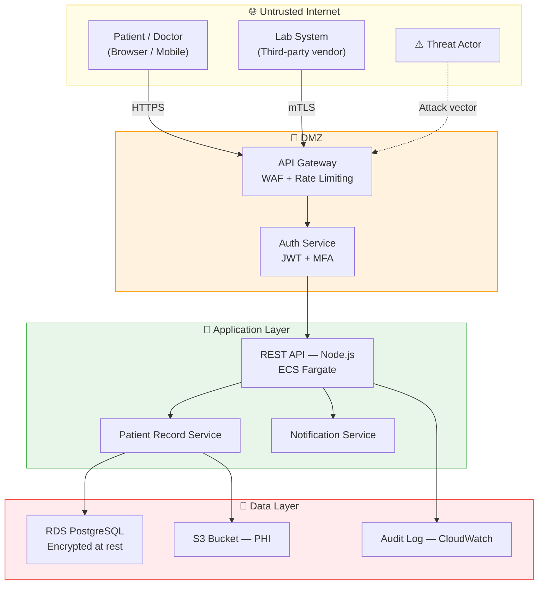

# Complete-threat-model-for-healthcare-application
Healthcare platform threat model using STRIDE, MITRE ATT&CK, Cyber Kill Chain, attack trees, DREAD risk scoring, and NIST CSF control mapping. 31 threats identified across 6 categories.

# Complete Threat Model


> *I built this to show how I'd approach threat modelling on a healthcare system — working through 31 threats across the full attack surface, mapping each one to MITRE ATT&CK, scoring by risk, and tying everything back to what actually needs fixing before go-live. The platform is fictional; the methodology and findings reflect what I'd produce on a real engagement.*

---

## Executive Summary

Solaris Care Connect 360 is a fictional cloud-native healthcare platform built on AWS, handling patient appointments, medical records, and third-party lab integrations. Thirty-one threats were identified, scored by risk severity, and mapped to real attacker techniques using the MITRE ATT&CK framework.

The three most critical findings were: no web application firewall on the patient records API (a single SQL injection request could expose the entire database); multi-factor authentication not enforced for patient accounts (vulnerable to automated credential stuffing with no technical skill required); and cloud backups not configured with tamper protection (a ransomware attack could destroy recovery capability entirely). All three were assessed as pre-launch blockers.

The recommended first action is deploying AWS WAF in front of the API Gateway — this single control mitigates the highest-scoring threat (DREAD 9.4/10) and can be implemented in under a day. Full remediation roadmap, control recommendations, and UK GDPR / NHS DSPT compliance obligations are documented in the detailed report below.

---

## 📋 Table of Contents

- [Overview](#overview)
- [What Was Modelled](#what-was-modelled)
- [Assumptions & Scope](#assumptions--scope)
- [Methodology](#methodology)
- [Architecture](#architecture)
- [Threat Coverage](#threat-coverage)
- [Key Findings](#key-findings)
- [Attack Simulation](#attack-simulation)
- [ATT&CK Navigator Layer](#attck-navigator-layer)
- [What I Would Do Next](#what-i-would-do-next)
- [Skills Demonstrated](#skills-demonstrated)
- [Repository Structure](#repository-structure)
- [License](#license)

---

## Overview

**Solaris Care Connect 360** is a fictional cloud-native healthcare platform built on AWS, handling appointment booking, patient records (PHI), clinical notes, and third-party lab integrations. This project delivers a complete security threat model as would be produced by a security engineer at the design phase of a real product.

This is not a theoretical exercise — every threat, attack path, and control recommendation reflects patterns observed in real healthcare breaches (Change Healthcare 2024, Anthem 2015, NHS WannaCry 2017).

**Who this is for:**
- Security engineering and DevSecOps hiring managers reviewing portfolio work
- Developers building healthcare or regulated-data applications
- Anyone learning structured threat modelling methodology

---

## What Was Modelled

| Component | Description |
|-----------|-------------|
| **Platform** | Cloud-native healthcare SaaS on AWS |
| **Data sensitivity** | Patient PHI — NHS DSPT + UK GDPR scope |
| **Users** | Patients, doctors, admins, lab integrations |
| **Infrastructure** | ECS containers, RDS PostgreSQL, API Gateway, S3, VPC |
| **Integrations** | Lab result feeds, NHS login (OAuth), email/SMS notifications |

---

## Assumptions & Scope

This is a **design-phase threat model** for a fictional platform. The following assumptions and boundaries apply:

- **Cloud provider trust** — AWS managed services (e.g. RDS, S3, API Gateway) are treated as trusted building blocks configured according to vendor best practices. Underlying AWS infrastructure hardening is out of scope.
- **Identity and endpoints** — Corporate endpoints, staff devices, and the NHS login identity provider are modelled only as trust boundaries, not fully threat-modelled systems in their own right.
- **Operational processes** — SOC runbooks, detailed incident response procedures, and backup/restore processes are referenced at a high level but not exhaustively modelled.
- **Data and traffic** — All patient data is entirely fictitious. No live traffic or production systems are involved; this mirrors the kind of threat model produced before a real build.

These assumptions match how a threat model would normally be scoped at architecture review time and can be tightened in future iterations when more implementation detail is available.

---

## Methodology

Five industry-standard frameworks were applied in sequence:

```
Data Flow Diagram → STRIDE Analysis → MITRE ATT&CK Mapping → DREAD Scoring → Control Mapping (NIST CSF)
```

| Framework | Purpose |
|-----------|---------|
| **DFD (Data Flow Diagram)** | Map all system components, data flows, and trust boundaries |
| **STRIDE** | Categorise threats by type: Spoofing, Tampering, Repudiation, Information Disclosure, DoS, Elevation of Privilege |
| **MITRE ATT&CK** | Map each threat to real attacker tactics and techniques |
| **DREAD** | Score each threat by Damage, Reproducibility, Exploitability, Affected Users, Discoverability |
| **Cyber Kill Chain** | Model how a full attack progresses from reconnaissance to exfiltration |
| **Attack Trees** | Visualise all possible paths to each attacker goal |
| **NIST CSF** | Map controls to Identify, Protect, Detect, Respond, Recover functions |

---

## Architecture

The system modelled across four trust boundary zones:



---

## Threat Coverage

**31 threats identified** across 6 STRIDE categories:

| STRIDE Category | Threats Found | Highest DREAD Score | Status |
|----------------|:-------------:|:-------------------:|--------|
| **S** — Spoofing | 5 | 8.2 | 🟡 Partial controls |
| **T** — Tampering | 5 | 9.1 | 🔴 Gap identified |
| **R** — Repudiation | 5 | 7.4 | 🟡 Partial controls |
| **I** — Information Disclosure | 6 | 9.4 | 🔴 Critical gap |
| **D** — Denial of Service | 5 | 7.8 | 🟢 Controls in place |
| **E** — Elevation of Privilege | 5 | 8.6 | 🔴 Gap identified |

### Top 5 Critical Threats

| # | Threat | DREAD Score | MITRE Technique | Control Gap |
|---|--------|:-----------:|----------------|-------------|
| 1 | SQL Injection on patient records API | **9.4** | T1190 | No WAF deployed |
| 2 | PHI exfiltration via broken access control | **9.1** | T1530 | IDOR not fully remediated |
| 3 | Credential stuffing on patient portal | **8.8** | T1110.004 | MFA not enforced for patients |
| 4 | Insider privilege abuse — bulk export | **8.6** | T1078 | No User Behaviour Analytics |
| 5 | Ransomware via phishing → lateral movement | **8.4** | T1486 | Backups not immutable |

---

## Key Findings

### 🔴 Critical Gaps (Pre-launch blockers)

1. **No WAF deployed** — SQL injection on the patient records endpoint can dump the entire database in a single request
2. **MFA not enforced for patient accounts** — credential stuffing is the lowest-effort attack with zero technical skill required
3. **S3 Object Lock not configured** — ransomware attack can destroy backups, making recovery impossible
4. **No User Behaviour Analytics** — insider data theft is completely undetectable without a behavioural baseline

### 🟡 Significant Gaps (Fix within 30 days)

5. IDOR vulnerability allows a doctor to query records outside their assigned patient list
6. Audit logs exist but are not write-once — a sophisticated attacker can delete evidence of their access
7. Client-side RBAC checks can be bypassed by modifying API requests directly

---

## Attack Simulation

A full APT (Advanced Persistent Threat) simulation was modelled — a day-by-day timeline of how a financially motivated threat actor would steal 100,000 patient records from Solaris, from initial reconnaissance to dark web sale:

```
Day 1  → Reconnaissance: OSINT on LinkedIn, job postings, GitHub
Day 3  → Target: IT admin email identified
Day 5  → Delivery: Spearphishing email with malicious PDF macro
Day 5  → Exploitation: Reverse shell established
Day 6  → Credential harvest: VPN credentials found in email
Day 7  → Lateral movement: Database server reached
Day 8  → Exfiltration: 100,000 records exported via HTTPS
Day 9  → Cover: Logs deleted, backdoor removed
Day 30 → Discovery: Breach found during audit (21-day gap)
```

**Without controls:** 100,000 records exfiltrated, 21-day detection gap, GDPR breach notification required.

**With all recommended controls:** Attack chain broken at Day 5 (email sandbox detonates PDF macro before delivery).

Full simulation with detection point analysis is in [`reports/threat-model-report.md`](reports/threat-model-report.md).

---

## ATT&CK Navigator Layer

**File:** [`reports/solaris-layer.json`](reports/solaris-layer.json)

`solaris-layer.json` is a **MITRE ATT&CK Navigator layer file** — a machine-readable JSON export that visualises exactly which ATT&CK tactics and techniques are relevant to this threat model, colour-coded by severity.

### What it contains

Every MITRE ATT&CK technique mapped in this threat model is encoded in the layer file with:
- **Technique ID and name** (e.g. T1190 — Exploit Public-Facing Application)
- **Colour score** — techniques are heat-mapped by DREAD risk score (red = critical, amber = high, yellow = medium)
- **Comment** — the specific Solaris threat each technique maps to (e.g. "SQL injection on patient records API — DREAD 9.4")
- **Tactic context** — each technique is pinned to its correct ATT&CK tactic column

### How to import it into ATT&CK Navigator

ATT&CK Navigator is a free, browser-based tool maintained by MITRE. No account or installation required.

1. Open [https://mitre-attack.github.io/attack-navigator/](https://mitre-attack.github.io/attack-navigator/) in your browser
2. Click **"Open Existing Layer"**
3. Select **"Upload from local"**
4. Choose `reports/solaris-layer.json` from this repository
5. The matrix will load showing all 21 mapped techniques highlighted across 10 ATT&CK tactics

### What you will see

Once loaded, the Navigator matrix shows:

| Colour | Meaning |
|--------|---------|
| 🔴 Red | Critical severity (DREAD ≥ 9.0) — SQL Injection, Exposed Backup |
| 🟠 Orange | High severity (DREAD 8.0–8.9) — Credential Stuffing, Phishing, Insider Abuse |
| 🟡 Yellow | Medium severity (DREAD 6.0–7.9) — DoS, Repudiation threats |
| ⬜ Grey | Tactics present in ATT&CK but not applicable to this architecture |

The two unhighlighted tactic columns — **Lateral Movement** and **Command & Control** — represent the acknowledged coverage gaps documented in [`reports/analyses/mitre-mapping.md`](reports/analyses/mitre-mapping.md), and will be addressed in the next iteration of this threat model. The layer has been imported and validated in the ATT&CK Navigator web UI to confirm it renders correctly.

---

## What I Would Do Next

This section documents how this threat model would be extended in a real engagement — covering validation, automation, and coverage gaps.

### If this were a real product

- **Live penetration test** — scope the API Gateway and auth endpoints for a black-box test to validate whether the SQLi and IDOR findings are truly exploitable, not just theoretically present. Theoretical identification and confirmed exploitation are two different risk levels.
- **Purple team exercise** — run the Day 5 phishing scenario with a red team and measure whether the email sandbox control actually breaks the kill chain as modelled. Controls that look good on paper frequently fail under realistic conditions.
- **Threat model refresh cadence** — schedule a mandatory re-review at every major architecture change: new third-party integration, new data classification, new AWS service. Threat models go stale faster than code.

### If this were integrated into a CI/CD pipeline

- **[Semgrep](https://semgrep.dev/)** — static analysis rules to catch SQL injection patterns and hardcoded credentials at PR merge, before code reaches staging. Custom rules can be written to flag the exact IDOR pattern identified in this model.
- **[Checkov](https://www.checkov.io/)** — infrastructure-as-code scanning to flag S3 buckets missing Object Lock, overly permissive security groups, and unencrypted RDS instances automatically on every Terraform plan.
- **[OWASP Dependency-Check](https://owasp.org/www-project-dependency-check/)** — automated CVE scanning of Node.js dependencies on every build, ensuring newly disclosed vulnerabilities in third-party packages are caught before deployment.

### Coverage gaps I would close

- **Map Lateral Movement (T1021 — Remote Services)** — currently the largest gap in the ATT&CK layer; critical for modelling how an attacker moves from a compromised ECS container to the RDS database layer. This would be the focus of the next iteration once Phase 0 and Phase 1 risks in the risk register are mitigated, and would drive concrete detections around remote service use between application and data tiers.
- **Map Command & Control (T1071 — Application Layer Protocol)** — models how an attacker maintains persistence and exfiltrates data over HTTPS without triggering standard network alerts. This would be addressed alongside lateral movement, informing detection rules around unusual outbound HTTPS patterns from application components.
- **Formalise the NHS login (OAuth) integration as a separate threat surface** — the current model treats it as a single trust boundary crossing; a full OAuth threat model would apply STRIDE across all four OAuth grant flows.
- **Add a UBA detection rule set** — translate the insider threat scenario into concrete Splunk/Elastic detection queries (bulk export >500 records, off-hours access, geolocation anomalies) so the model produces actionable detection engineering output.

---

## Skills Demonstrated

### Security Engineering
- **Threat Modelling (STRIDE):** Systematic identification and categorisation of 31 threats across all six STRIDE categories applied to a realistic cloud architecture
- **Risk Scoring (DREAD):** Quantitative risk scoring enabling priority-ordered remediation — the highest-scoring threat (SQLi, 9.4) was identified as a pre-launch blocker
- **Attack Tree Analysis:** Multi-path attacker goal decomposition with AND/OR node logic used to identify the lowest-effort attack path (credential stuffing, zero skill required)
- **MITRE ATT&CK Mapping:** Every threat mapped to specific ATT&CK techniques, with a Navigator layer file for visual tactic coverage review

### DevSecOps & Secure Architecture
- **Security-by-design:** Controls recommended at the architecture stage, not as afterthoughts — demonstrating shift-left security thinking
- **NIST CSF Control Mapping:** All 31 threats mapped to NIST CSF functions (Identify, Protect, Detect, Respond, Recover) with implementation status tracked
- **Compliance Awareness:** NHS DSPT mandatory standards, UK GDPR Article 32, and ICO 72-hour breach notification obligations (Article 33) applied throughout
- **Immutable Infrastructure Security:** AWS-specific recommendations including S3 Object Lock, CloudTrail log integrity, and VPC flow log analysis

### Documentation & Communication
- **Executive-ready risk register:** DREAD-scored risk register structured for both technical teams and non-technical stakeholders
- **Cyber Kill Chain analysis:** Full kill chain documented per threat, enabling both detection engineering and incident response planning
- **APT simulation:** Realistic day-by-day attack timeline demonstrating understanding of real attacker behaviour and dwell time

---

## Repository Structure

```
complete-threat-model-for-healthcare-application/
│
├── README.md                                    # Project overview and documentation
├── LICENSE                                      # MIT Licence
│
├── diagrams/
│   ├── architecture.md                          # System architecture and trust boundaries
│   ├── attack-trees.md                          # Attack trees for all attacker goals
│   ├── dfd-level0.md                            # Level 0 Data Flow Diagram (context)
│   └── dfd-level1.md                            # Level 1 Data Flow Diagram (detail)
│
└── reports/
    ├── threat-model-report.md                   # Full consolidated threat model report
    ├── solaris-layer.json                        # ATT&CK Navigator layer — import at mitre-attack.github.io/attack-navigator
    └── analyses/
        ├── stride-threats.md                    # STRIDE threat catalogue (31 threats)
        ├── mitre-mapping.md                     # MITRE ATT&CK technique mapping
        ├── kill-chain-analysis.md               # Cyber Kill Chain per attack scenario
        ├── risk-register.md                     # DREAD-scored risk register
        └── security-control-mapping.md          # NIST CSF control mapping and gap analysis
```

---

## License

MIT License — see [LICENSE](LICENSE) for details.

> **Note:** Solaris Care Connect 360 is a fictional platform created for threat modelling and portfolio purposes. All patient data referenced is entirely fictitious.
