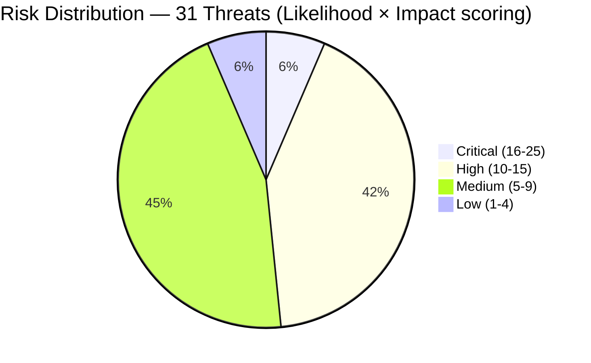

# Risk Register — Solaris Care Connect 360

---

## What is a Risk Register?

A risk register is the **single source of truth** for all identified risks in
a system. It answers three questions for every threat:

1. **How likely is this to happen?** (Likelihood)
2. **How bad would it be if it did?** (Impact)
3. **What do we do about it?** (Remediation)

Risk registers are a core requirement of HIPAA, ISO 27001, and SOC2.
Every enterprise security team maintains one. Without it, you're making
security decisions based on gut feel rather than evidence.

---

## Risk Scoring Methodology

Risk is calculated using a simple formula:

> **Risk Score = Likelihood × Impact**

This gives every threat a number from 1–25, which determines how urgently
it needs to be fixed.

### Likelihood Scale

| Score | Label | Meaning |
|-------|-------|---------|
| 5 | Almost Certain | Expected to occur — attacker is actively targeting this |
| 4 | Likely | Will probably occur — common attack vector in healthcare |
| 3 | Possible | Could occur — requires some skill or opportunity |
| 2 | Unlikely | Could occur occasionally — difficult to exploit |
| 1 | Rare | Very unlikely — requires rare skill or inside knowledge |

### Impact Scale

| Score | Label | Meaning |
|-------|-------|---------|
| 5 | Severe | Catastrophic — full PHI breach, patient harm, business shutdown |
| 4 | Major | Serious — significant breach, HIPAA fine, reputational damage |
| 3 | Moderate | Significant — partial data exposure, service disruption |
| 2 | Minor | Small — limited impact, quick recovery |
| 1 | Negligible | Minimal — barely noticeable effect |

### Priority Thresholds

| Risk Score | Priority | Required Action |
|------------|----------|----------------|
| 16 – 25 | 🔴 Critical | Immediate action — fix before launch |
| 10 – 15 | 🟠 High | Address within 30 days |
| 5 – 9 | 🟡 Medium | Address within 90 days |
| 1 – 4 | 🟢 Low | Accept or fix when convenient |

> ⚠️ Don't try to fix everything at once — prioritise based on risk score.
> A Critical risk ignored while fixing Low risks is a security failure.

---

## Risk Matrix

Use this matrix to find any risk's priority at a glance.
Find the row (Likelihood), find the column (Impact), read the score.

|  | **Impact 1** | **Impact 2** | **Impact 3** | **Impact 4** | **Impact 5** |
|--|:---:|:---:|:---:|:---:|:---:|
| **Likelihood 5** | 5 🟡 | 10 🟠 | 15 🟠 | 20 🔴 | 25 🔴 |
| **Likelihood 4** | 4 🟢 | 8 🟡 | 12 🟠 | 16 🔴 | 20 🔴 |
| **Likelihood 3** | 3 🟢 | 6 🟡 | 9 🟡 | 12 🟠 | 15 🟠 |
| **Likelihood 2** | 2 🟢 | 4 🟢 | 6 🟡 | 8 🟡 | 10 🟠 |
| **Likelihood 1** | 1 🟢 | 2 🟢 | 3 🟢 | 4 🟢 | 5 🟡 |

---

## DREAD Scoring Model

For the highest-priority threats, we use **DREAD** to add more precision.
DREAD breaks each threat into five dimensions — giving a more nuanced score
than simple Likelihood × Impact.

**DREAD Score = (D + R + E + A + D) ÷ 5**

| Letter | Dimension | Question it answers |
|--------|-----------|---------------------|
| **D** | Damage Potential | How bad is the worst-case outcome? (0–10) |
| **R** | Reproducibility | How easily can the attack be repeated? (0–10) |
| **E** | Exploitability | How much skill does the attacker need? (0–10) |
| **A** | Affected Users | How many users are impacted? (0–10) |
| **D** | Discoverability | How easily can the attacker find this flaw? (0–10) |

> 💡 Use DREAD when two threats have the same Likelihood × Impact score
> and you need to decide which to fix first. It breaks the tie.

---

## Full Risk Register

> All 31 STRIDE threats scored. Sorted by Risk Score (highest first).

| ID | Threat | STRIDE | Likelihood | Impact | Score | Priority | Deadline |
|----|--------|--------|:----------:|:------:|:-----:|----------|----------|
| I1 | SQL Injection — PHI Breach | I | 4 | 5 | **20** | 🔴 Critical | Pre-launch |
| S1 | Credential Theft via Phishing | S | 4 | 4 | **16** | 🔴 Critical | Pre-launch |
| E4 | Container Escape to Host | E | 3 | 5 | **15** | 🟠 High | 30 days |
| E3 | SQLi → DBA Access | E | 3 | 5 | **15** | 🟠 High | 30 days |
| I4 | Unencrypted Data in Transit | I | 3 | 5 | **15** | 🟠 High | Pre-launch |
| I5 | Exposed Backup Files | I | 3 | 5 | **15** | 🟠 High | Pre-launch |
| S2 | Fake Doctor Accounts | S | 3 | 5 | **15** | 🟠 High | 30 days |
| E1 | Patient → Doctor Privilege | E | 3 | 4 | **12** | 🟠 High | 30 days |
| T1 | Patient Record Modification | T | 3 | 4 | **12** | 🟠 High | 30 days |
| I2 | Excessive Data Return | I | 4 | 3 | **12** | 🟠 High | 30 days |
| I6 | PHI in Logs | I | 3 | 4 | **12** | 🟠 High | 30 days |
| E2 | Doctor → Admin Privilege | E | 2 | 5 | **10** | 🟠 High | 30 days |
| T2 | Prescription Alteration | T | 2 | 5 | **10** | 🟠 High | 30 days |
| T5 | Vitals Data Tampering | T | 2 | 5 | **10** | 🟠 High | 30 days |
| S5 | Lab Result Spoofing | S | 2 | 5 | **10** | 🟠 High | 30 days |
| D1 | DDoS Attack | D | 3 | 3 | **9** | 🟡 Medium | 90 days |
| D2 | Database Exhaustion | D | 3 | 3 | **9** | 🟡 Medium | 90 days |
| E5 | IDOR — Other Patient Records | E | 3 | 3 | **9** | 🟡 Medium | 90 days |
| T4 | Claims Manipulation | T | 3 | 3 | **9** | 🟡 Medium | 90 days |
| D5 | Rx Service Overload | D | 3 | 3 | **9** | 🟡 Medium | 90 days |
| T3 | Audit Log Tampering | T | 2 | 4 | **8** | 🟡 Medium | 90 days |
| S3 | Token Forgery | S | 2 | 4 | **8** | 🟡 Medium | 90 days |
| R5 | Export Audit Gap | R | 2 | 4 | **8** | 🟡 Medium | 90 days |
| R3 | Permission Change Denial | R | 2 | 4 | **8** | 🟡 Medium | 90 days |
| I3 | Verbose Error Messages | I | 3 | 2 | **6** | 🟡 Medium | 90 days |
| D3 | Storage Exhaustion | D | 3 | 2 | **6** | 🟡 Medium | 90 days |
| R1 | Prescription Denial | R | 2 | 3 | **6** | 🟡 Medium | 90 days |
| S4 | MITM on Insurance API | S | 2 | 3 | **6** | 🟡 Medium | 90 days |
| R4 | Claim Receipt Denial | R | 2 | 3 | **6** | 🟡 Medium | 90 days |
| D4 | Mass Account Lockout | D | 2 | 2 | **4** | 🟢 Low | Backlog |
| R2 | Patient Access Denial | R | 1 | 3 | **3** | 🟢 Low | Backlog |

---

## DREAD Deep Dive — Top 5 Critical Threats

> Applied to the 5 highest-scoring threats for precision prioritisation.

### I1 — SQL Injection (Risk Score: 20)

| Dimension | Score | Reasoning |
|-----------|:-----:|-----------|
| Damage Potential | 10 | Full PHI database exposure — 100,000+ records |
| Reproducibility | 9 | Automated tools can repeat attack in seconds |
| Exploitability | 7 | Requires basic SQL knowledge — tutorials freely available |
| Affected Users | 10 | All patients in the database |
| Discoverability | 8 | API parameter testing reveals it quickly |
| **DREAD Score** | **8.8 / 10** | **Highest priority in entire register** |

**Remediation:** Parameterised queries (immediate) + WAF deployment (this week)

---

### S1 — Credential Theft via Phishing (Risk Score: 16)

| Dimension | Score | Reasoning |
|-----------|:-----:|-----------|
| Damage Potential | 8 | Compromised account exposes assigned patients |
| Reproducibility | 10 | Mass phishing campaigns are fully automated |
| Exploitability | 9 | No technical skill needed — just send emails |
| Affected Users | 7 | Depends on which account is compromised |
| Discoverability | 8 | Staff email addresses publicly available on LinkedIn |
| **DREAD Score** | **8.4 / 10** | **Second highest priority** |

**Remediation:** MFA enforcement (immediate) + phishing simulation training (month 1)

---

### E4 — Container Escape (Risk Score: 15)

| Dimension | Score | Reasoning |
|-----------|:-----:|-----------|
| Damage Potential | 10 | Host access = full server compromise |
| Reproducibility | 5 | Requires specific CVE — not always possible |
| Exploitability | 4 | High skill required — container exploit knowledge |
| Affected Users | 10 | All users if host is compromised |
| Discoverability | 4 | Only visible with internal access |
| **DREAD Score** | **6.6 / 10** | High damage but difficult to exploit |

**Remediation:** Read-only containers + no privileged mode + Falco runtime monitoring

---

### I4 — Unencrypted Data in Transit (Risk Score: 15)

| Dimension | Score | Reasoning |
|-----------|:-----:|-----------|
| Damage Potential | 10 | Intercept PHI in plaintext — complete exposure |
| Reproducibility | 8 | Network sniffing tools are freely available |
| Exploitability | 6 | Requires network access (coffee shop, VPN, ISP) |
| Affected Users | 10 | All users transmitting data |
| Discoverability | 7 | Port scan reveals HTTP vs HTTPS quickly |
| **DREAD Score** | **8.2 / 10** | Simple to fix — TLS should be on by default |

**Remediation:** TLS 1.2+ enforced on all endpoints + HSTS headers (immediate)

---

### I5 — Exposed Backup Files (Risk Score: 15)

| Dimension | Score | Reasoning |
|-----------|:-----:|-----------|
| Damage Potential | 10 | Full database snapshot — worse than live breach |
| Reproducibility | 10 | If bucket is public — any attacker can download repeatedly |
| Exploitability | 10 | Zero skill needed — just an HTTP GET request |
| Affected Users | 10 | All patients — entire database in one file |
| Discoverability | 9 | Automated S3 scanners find public buckets in minutes |
| **DREAD Score** | **9.8 / 10** | Most easily exploitable threat in the register |

**Remediation:** Block all S3 public access + enable AES-256 encryption (today)

---

## Risk Distribution

> **📌 Note on Critical count — two scoring systems in use:**
> This register uses **Likelihood × Impact (L×I)** thresholds, where Critical
> = score ≥ 16. By this measure, **2 threats** are Critical (I1 at 20, S1 at 16).
>
> The STRIDE threat register (`stride-threats.md`) uses **healthcare severity
> labels**, where any threat with Impact = 5 (catastrophic PHI breach or patient
> harm) is labelled Critical regardless of likelihood — giving **12 Critical**
> threats. This is standard practice in clinical risk frameworks where a
> low-probability catastrophic outcome still demands pre-launch mitigation.
>
> **Both counts are correct for their purpose:**
> - Use L×I scores (this file) for engineering prioritisation and sprint planning
> - Use severity labels (`stride-threats.md`) for clinical risk communication and executive reporting
>
> The full methodology bridge is documented in
> [`threat-model-report.md` §4.1](../threat-model-report.md#41-risk-scoring-methodology).

---

## Prioritised Remediation Plan

> Sorted strictly by risk score. Fix in this order.

### 🔴 Phase 0 — Pre-Launch Blockers (Fix before go-live)

| # | ID | Threat | Score | Action | Owner |
|---|----|--------|:-----:|--------|-------|
| 1 | I5 | Exposed backups | 15 | Block S3 public access, enable AES-256 encryption | DevOps |
| 2 | I1 | SQL Injection | 20 | Parameterised queries + WAF | Backend |
| 3 | I4 | Unencrypted transit | 15 | Enforce TLS 1.2+, add HSTS headers | Backend |
| 4 | S1 | Credential phishing | 16 | Enforce MFA on all accounts | Backend |

> These 4 must be resolved before any patient data enters the system.

---

### 🟠 Phase 1 — 30-Day Fixes

| # | ID | Threat | Score | Action | Owner |
|---|----|--------|:-----:|--------|-------|
| 5 | E4 | Container escape | 15 | Read-only containers, Falco runtime security | DevOps |
| 6 | E3 | SQLi to DBA | 15 | DB least privilege — app user SELECT-only | DevOps |
| 7 | S2 | Fake doctor accounts | 15 | Admin approval workflow + MFA | Backend |
| 8 | E1 | Privilege escalation | 12 | RBAC audit — server-side check on every API | Backend |
| 9 | T1 | Record modification | 12 | Field-level hashing, write audit logs | Backend |
| 10 | I2 | Excessive data return | 12 | API field allowlists, response filtering | Backend |
| 11 | I6 | PHI in logs | 12 | Log scrubbing rules, PII-aware logging libraries | Backend |
| 12 | E2 | Doctor → Admin privilege | 10 | Separate admin accounts, MFA for admin actions | Backend |
| 13 | T2 | Prescription alteration | 10 | Digital Rx signatures, immutable Rx log | Backend |
| 14 | T5 | Vitals tampering | 10 | Sensor signing, threshold anomaly alerts | Backend |
| 15 | S5 | Lab result spoofing | 10 | mTLS + result signing with lab systems | DevOps |

---

### 🟡 Phase 2 — 90-Day Fixes

| # | ID | Threat | Score | Action | Owner |
|---|----|--------|:-----:|--------|-------|
| 16 | D1 | DDoS | 9 | WAF rate limiting + CloudFront CDN | DevOps |
| 17 | D2 | DB exhaustion | 9 | Query timeouts, connection pool limits | DevOps |
| 18 | E5 | IDOR | 9 | Server-side patient ownership checks | Backend |
| 19 | T4 | Claims manipulation | 9 | Payload signing, encrypted DB fields, reconciliation checks | Backend |
| 20 | D5 | Rx service overload | 9 | Input validation, request rate limiting, queue depth monitoring | DevOps |
| 21 | T3 | Audit log tampering | 8 | Write-once audit DB, off-system backup | DevOps |
| 22 | S3 | Token forgery | 8 | Short JWT expiry, token rotation | Backend |
| 23 | R5 | Export audit gap | 8 | Mandatory export logging, DLP | Backend |
| 24 | R3 | Permission change denial | 8 | Admin action logging, dual-approval for privilege changes | Backend |
| 25 | I3 | Verbose errors | 6 | Generic error messages in production | Backend |
| 26 | D3 | Storage exhaustion | 6 | Upload quotas, storage monitoring | DevOps |
| 27 | R1 | Prescription denial | 6 | Signed Rx approvals, timestamped logs | Backend |
| 28 | S4 | MITM on insurance | 6 | Certificate pinning on insurance API | Backend |
| 29 | R4 | Claim receipt denial | 6 | Signed receipts, message delivery acknowledgements | Backend |

---

### 🟢 Phase 3 — Backlog (Low Priority)

| # | ID | Threat | Score | Action |
|---|----|--------|:-----:|--------|
| 30 | D4 | Mass account lockout | 4 | Progressive lockout delays, CAPTCHA |
| 31 | R2 | Patient access denial | 3 | Immutable access logs |

---

## Risk Scoring Rationale

The Likelihood × Impact matrix provides a consistent, repeatable scoring
methodology across all threats. DREAD supplements this for the highest-priority
threats by breaking down exploitability into five measurable dimensions —
preventing a catastrophic-but-difficult attack from being incorrectly ranked
above a moderate-but-trivially-easy one.

**Key insight:** Exposed Backups (I5) scores highest on DREAD (9.8/10) not
because it causes the most damage, but because it requires zero technical
skill to exploit. A public S3 bucket can be discovered and downloaded
by automated scanners within minutes of being misconfigured. This is why
exploitability must be weighted alongside damage potential in any credible
risk assessment.

---

## Glossary

| Term | Definition |
|------|-----------|
| **Risk Score** | Likelihood × Impact — a number from 1 to 25 |
| **DREAD** | Five-dimension risk scoring model: Damage, Reproducibility, Exploitability, Affected Users, Discoverability |
| **Pre-launch blocker** | A risk that must be fully mitigated before the system accepts live patient data |
| **Residual risk** | Risk that remains after all mitigations have been applied |
| **Risk appetite** | The level of risk an organisation formally accepts as tolerable |
| **Risk owner** | The individual accountable for remediating a specific risk |
| **Severity label** | Clinical risk classification (Critical/High/Medium/Low) based on impact magnitude, used in `stride-threats.md` — a threat with Impact = 5 is Critical regardless of likelihood |
| **L×I threshold** | Quantitative priority band derived from Likelihood × Impact score, used in this register — Critical requires score ≥ 16 |
