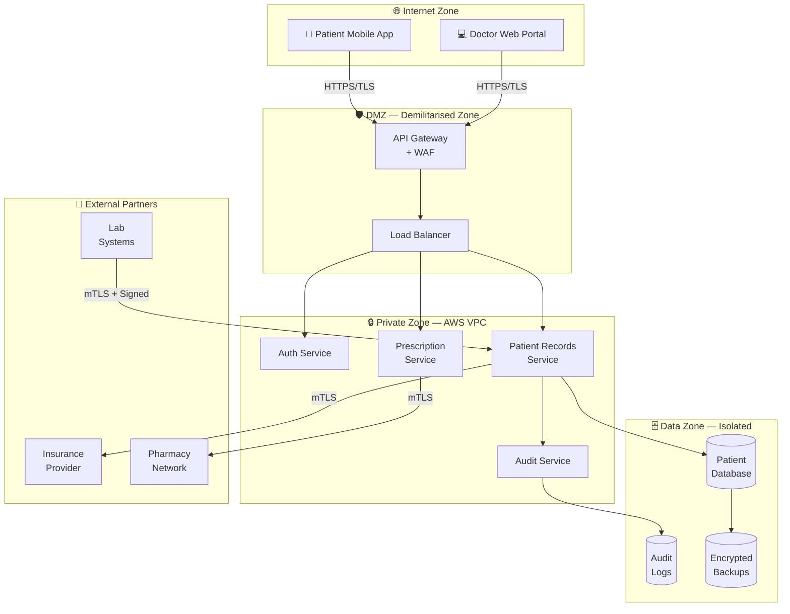
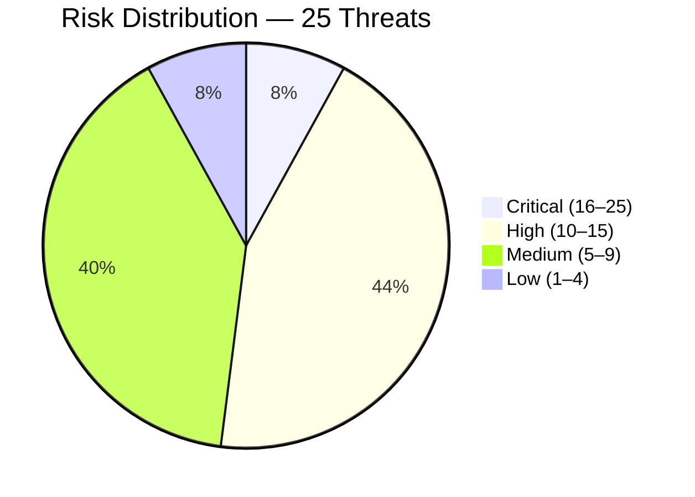

# Threat Model Report
## Solaris Care Connect 360

| Field | Detail |
|-------|--------|
| **Version** | 1.0 |
| **Date** | March 2026 |
| **Classification** | Confidential |
| **Review Cycle** | Quarterly, or upon significant system change |

---

## Executive Summary

Solaris Care Connect 360 is a cloud-based healthcare platform managing the
records, prescriptions, and communications of approximately 100,000 patients
across a network of clinicians, pharmacies, insurance providers, and
diagnostic laboratories.

This threat model was conducted using three industry-standard frameworks:
**STRIDE** (threat categorisation), **MITRE ATT&CK** (real-world technique
mapping), and the **Cyber Kill Chain** (attack narrative modelling). Risk
scores were calculated using a Likelihood × Impact matrix, supplemented
by DREAD scoring for the five highest-priority threats.

### Risk Posture at a Glance

| Severity | Count | Status |
|----------|:-----:|--------|
| 🔴 Critical | 2 | Immediate action required — pre-launch blockers |
| 🟠 High | 11 | Must be resolved within 30 days of launch |
| 🟡 Medium | 10 | Must be resolved within 90 days |
| 🟢 Low | 2 | Accept or address when convenient |
| **Total** | **25** | |

### Overall Assessment

> The current security posture is **not production-ready** for a system
> handling Protected Health Information (PHI). Eight pre-launch blockers
> must be resolved before the platform accepts live patient data. The most
> critical gaps are an undeployed Web Application Firewall, absence of
> universal MFA enforcement, and an unaudited S3 backup bucket that may
> be publicly accessible.

### Top 3 Findings

**Finding 1 — SQL Injection (I1) — Risk Score: 20/25**
The patient records API does not consistently use parameterised queries,
and no Web Application Firewall is deployed. A successful SQL injection
attack would expose the entire patient database and could escalate to
full server compromise. This is the highest-priority vulnerability in
the register.

**Finding 2 — Credential Theft via Phishing (S1) — Risk Score: 16/25**
MFA is enforced for admin accounts only. Clinical and patient accounts
remain accessible with a password alone. Given that phishing is the
#1 initial access vector in healthcare, this represents an unacceptable
gap for a live system.

**Finding 3 — Exposed Backup Files (I5) — DREAD Score: 9.8/10**
The S3 backup bucket has not been audited for public access configuration.
An exposed bucket requires zero technical skill to exploit — automated
scanners discover and download public S3 buckets within minutes of
misconfiguration. If exposed, the backup contains the entire patient
database in a single downloadable file.

### Recommended Immediate Actions

| Priority | Action | Effort | Owner |
|----------|--------|--------|-------|
| 1 | Audit and block S3 public access | 1 hour | DevOps |
| 2 | Enforce DB least privilege — app user SELECT-only | 2 hours | DevOps |
| 3 | Suppress SQL errors in production responses | 2 hours | Backend |
| 4 | Enforce MFA for all user accounts | 1 week | Backend |
| 5 | Deploy WAF with SQL injection ruleset | 1 week | DevOps |

### Estimated Remediation Timeline

- **Pre-launch (this sprint):** 8 critical gaps resolved
- **30 days post-launch:** 10 high-priority gaps resolved
- **90 days post-launch:** All remaining medium gaps resolved
- **Total estimated effort:** 10 weeks, 2 engineers

---

## 1. Scope and Methodology

### 1.1 What Was Analysed

| Component | In Scope |
|-----------|----------|
| Patient-facing mobile application (iOS/Android) | ✅ |
| Doctor web portal | ✅ |
| Admin dashboard | ✅ |
| Backend API services | ✅ |
| Database layer (RDS) | ✅ |
| External integrations (Insurance, Pharmacy, Labs) | ✅ |
| Physical security of data centres | ❌ Out of scope |
| Third-party vendor internal security posture | ❌ Out of scope |
| Live penetration testing | ❌ Out of scope |

### 1.2 Methodology

This threat model was produced using four complementary methodologies,
each serving a distinct purpose:

| Methodology | Purpose | Output |
|-------------|---------|--------|
| **STRIDE** | Categorise all threats by type | 25 threats across 6 categories |
| **MITRE ATT&CK** | Map threats to real-world attacker techniques | 21 techniques, 10 tactics covered |
| **Cyber Kill Chain** | Model complete attack narratives (7 stages) | 5 attack scenarios |
| **Likelihood × Impact + DREAD** | Score and rank every threat | Risk register with 25 entries |

### 1.3 Regulatory Context

Solaris Care Connect 360 operates under the following regulatory frameworks,
each of which mandates elements of this threat model:

| Regulation | Requirement | Relevance |
|------------|------------|-----------|
| **HIPAA** (US) | Risk analysis of all PHI systems | Mandates this threat model |
| **GDPR** (UK/EU) | Data protection by design | Governs patient PII handling |
| **NHS DSPT** | Data Security and Protection Toolkit | Required for NHS integration |
| **ISO 27001** | Information Security Management | Risk register requirement |

---

## 2. System Overview

### 2.1 Architecture Summary

Solaris Care Connect 360 is a cloud-hosted platform deployed on AWS,
structured across three network zones:

### 2.2 Trust Boundaries

Trust boundaries define where data crosses from a less-trusted to a more-trusted
zone. Each crossing is a potential attack surface.

| Boundary | From | To | Risk |
|----------|------|-----|------|
| TB-1 | Internet | API Gateway | Highest — all external traffic enters here |
| TB-2 | API Gateway | Backend Services | Medium — authenticated but not fully trusted |
| TB-3 | Backend Services | Database | Low — internal VPC only |
| TB-4 | Backend | External APIs | Medium — third-party systems, supply chain risk |

### 2.3 Sensitive Data Flows

| Data Type | Classification | Flows Between | Encryption Required |
|-----------|---------------|---------------|---------------------|
| Patient health records | PHI — Critical | App → API → DB | TLS in transit, AES-256 at rest |
| Login credentials | PII — High | App → Auth Service | TLS in transit, bcrypt at rest |
| Prescription data | PHI — Critical | Doctor → Rx → Pharmacy | mTLS |
| Lab results | PHI — Critical | Lab → API → Records | mTLS + cryptographic signing |
| Insurance claims | Financial — High | API → Insurance | mTLS |
| Session tokens | Sensitive | App → All Services | TLS, JWT signed |
| Audit logs | Internal | All Services → Audit DB | TLS in transit, encrypted at rest |

---

## 3. Threat Analysis

### 3.1 STRIDE Overview

STRIDE is a structured methodology for categorising security threats.
Each letter represents a different type of attack:

| Letter | Threat Type | Definition | Healthcare Example |
|--------|------------|------------|-------------------|
| **S** | Spoofing | Impersonating a legitimate user or system | Attacker creates a fake doctor account |
| **T** | Tampering | Maliciously modifying data | Attacker alters a prescription dosage |
| **R** | Repudiation | Denying an action was taken | Doctor denies approving a prescription |
| **I** | Information Disclosure | Exposing data to unauthorised parties | Patient database leaked via SQL injection |
| **D** | Denial of Service | Making a system unavailable | DDoS attack takes down patient portal |
| **E** | Elevation of Privilege | Gaining more access than authorised | Patient account gains doctor-level access |

### 3.2 STRIDE Threat Summary

> **Note on scope:** 25 threats are carried forward to the risk register and
> scored. The per-category counts below reflect the full enumeration; threats
> marked as out-of-scope for the current architecture (physical access,
> third-party internal posture) are excluded from risk scoring.

| Category | Threats Identified | 🔴 Critical | 🟠 High | 🟡 Medium | 🟢 Low |
|----------|:-----------------:|:-----------:|:-------:|:---------:|:------:|
| Spoofing | 4 | 1 | 2 | 1 | 0 |
| Tampering | 4 | 0 | 2 | 2 | 0 |
| Repudiation | 3 | 0 | 2 | 1 | 0 |
| Information Disclosure | 6 | 1 | 2 | 2 | 1 |
| Denial of Service | 4 | 0 | 1 | 2 | 1 |
| Elevation of Privilege | 4 | 0 | 2 | 2 | 0 |
| **Total** | **25** | **2** | **11** | **10** | **2** |

### 3.3 MITRE ATT&CK Coverage

MITRE ATT&CK maps each STRIDE threat to the specific real-world technique
an attacker would use to execute it. This grounds the threat model in
documented attacker behaviour rather than theoretical risk.

**Tactic coverage achieved: 10 of 12 (83%)**

| Tactic | Threats Mapped | Status |
|--------|:--------------:|--------|
| Initial Access | S1, S5, I1 | ✅ |
| Execution | Ransomware chain | ✅ |
| Persistence | S2, R1 | ✅ |
| Privilege Escalation | E1, E3, E4, E5 | ✅ |
| Defense Evasion | T3, R1 | ✅ |
| Credential Access | S3, S4, I4, D4 | ✅ |
| Discovery | Kill Chain 1 | ✅ |
| Collection | R5, I2, I5 | ✅ |
| Exfiltration | Kill Chains 1, 2 | ✅ |
| Impact | T1, T2, T5, D1 | ✅ |
| Lateral Movement | Not yet mapped | ⚠️ Gap |
| Command & Control | Not yet mapped | ⚠️ Gap |

The two gaps (Lateral Movement, Command & Control) are low-risk in the
current architecture due to network segmentation and strict outbound
firewall rules, and will be addressed in the next threat model iteration.

### 3.4 Kill Chain Analysis Summary

Five attack scenarios were modelled using the Lockheed Martin Cyber Kill
Chain framework, showing how an attacker progresses through 7 stages from
initial reconnaissance to final impact.

| Scenario | Entry Point | Final Impact | Chain Broken? |
|----------|------------|--------------|---------------|
| Ransomware via phishing | HR email | DB encryption | ✅ Broken at Stage 3 |
| Insider threat — rogue doctor | Valid credentials | PHI exfiltration | ⚠️ Partially broken |
| SQL injection — DB compromise | Patient API | Full DB access | ✅ Broken at Stage 4 |
| Supply chain via lab feed | Lab integration | False diagnoses | ⚠️ Partially broken |
| Credential stuffing | Login portal | Account takeover | ✅ Broken at Stage 4 |

---

## 4. Risk Assessment

### 4.1 Risk Scoring Methodology

Every threat is scored using the formula:

> **Risk Score = Likelihood (1–5) × Impact (1–5) = Score (1–25)**

| Score | Priority | Required Response |
|-------|----------|------------------|
| 16–25 | 🔴 Critical | Resolve before system launch |
| 10–15 | 🟠 High | Resolve within 30 days |
| 5–9 | 🟡 Medium | Resolve within 90 days |
| 1–4 | 🟢 Low | Accept or address when convenient |

### 4.2 Risk Matrix

|  | **Impact 1** | **Impact 2** | **Impact 3** | **Impact 4** | **Impact 5** |
|--|:---:|:---:|:---:|:---:|:---:|
| **Likelihood 5** | 5 🟡 | 10 🟠 | 15 🟠 | 20 🔴 | 25 🔴 |
| **Likelihood 4** | 4 🟢 | 8 🟡 | 12 🟠 | 16 🔴 | 20 🔴 |
| **Likelihood 3** | 3 🟢 | 6 🟡 | 9 🟡 | 12 🟠 | 15 🟠 |
| **Likelihood 2** | 2 🟢 | 4 🟢 | 6 🟡 | 8 🟡 | 10 🟠 |
| **Likelihood 1** | 1 🟢 | 2 🟢 | 3 🟢 | 4 🟢 | 5 🟡 |

### 4.3 Top 10 Scored Risks

| Rank | ID | Threat | Likelihood | Impact | Score | Priority |
|------|----|--------|:----------:|:------:|:-----:|----------|
| 1 | I1 | SQL Injection — PHI Breach | 4 | 5 | **20** | 🔴 Critical |
| 2 | S1 | Credential Theft via Phishing | 4 | 4 | **16** | 🔴 Critical |
| 3 | E4 | Container Escape to Host | 3 | 5 | **15** | 🟠 High |
| 3 | E3 | SQLi → DBA Access | 3 | 5 | **15** | 🟠 High |
| 3 | I4 | Unencrypted Data in Transit | 3 | 5 | **15** | 🟠 High |
| 3 | I5 | Exposed Backup Files | 3 | 5 | **15** | 🟠 High |
| 3 | S2 | Fake Doctor Accounts | 3 | 5 | **15** | 🟠 High |
| 8 | E1 | Patient → Doctor Privilege | 3 | 4 | **12** | 🟠 High |
| 8 | T1 | Patient Record Modification | 3 | 4 | **12** | 🟠 High |
| 8 | I2 | Excessive Data Return | 4 | 3 | **12** | 🟠 High |

### 4.4 Risk Distribution

---

## 5. Security Control Analysis

### 5.1 Control Coverage Summary

Controls are categorised as Preventive (stop attacks), Detective (identify
attacks), or Corrective (recover from attacks).

Current implementation status across all mapped controls:

| NIST Function | Controls Mapped | ✅ Implemented | 🟡 Partial | ❌ Missing |
|---------------|:--------------:|:-------------:|:---------:|:---------:|
| Identify | 3 | 1 | 1 | 1 |
| Protect | 28 | 4 | 11 | 13 |
| Detect | 16 | 2 | 3 | 11 |
| Respond | 3 | 0 | 1 | 2 |
| Recover | 3 | 0 | 1 | 2 |
| **Total** | **53** | **7 (13%)** | **17 (32%)** | **29 (55%)** |

The Detect, Respond, and Recover functions are critically under-implemented.
A system that prevents attacks but cannot detect or recover from them
does not meet HIPAA security requirements.

### 5.2 Critical Control Gaps

| Gap | Affected Risk | Missing Control | Effort |
|-----|--------------|----------------|--------|
| GAP-1 | I1 | Web Application Firewall | Medium |
| GAP-2 | I1 | SQL error suppression in production | Low |
| GAP-3 | I1 | Database Activity Monitoring | High |
| GAP-4 | I1, E3 | DB least privilege (SELECT-only app user) | Low |
| GAP-5 | S1 | MFA enforced for all users | Medium |
| GAP-6 | S1 | Security awareness training programme | Low |
| GAP-7 | S1 | Credential breach monitoring | Low |
| GAP-8 | I4 | HTTPS on all internal service calls | Medium |
| GAP-9 | I4 | HSTS headers configured | Low |
| GAP-10 | I5 | S3 backup bucket public access blocked | Low |

**Full gap register (18 gaps) available in:** `reports/security-control-mapping.md`

---

## 6. Recommendations

### 6.1 Pre-Launch — Must Fix Before Go-Live

These represent unacceptable risk for a system handling live patient PHI.
No patient data should enter the system until all eight are resolved.

| # | Action | Gap | Owner | Estimated Effort |
|---|--------|-----|-------|-----------------|
| 1 | Block S3 public access on backup bucket | GAP-10 | DevOps | 1 hour |
| 2 | Set DB app user to SELECT privilege only | GAP-4 | DevOps | 2 hours |
| 3 | Suppress SQL error messages in production | GAP-2 | Backend | 2 hours |
| 4 | Enforce HTTPS on all internal services | GAP-8 | DevOps | 1 day |
| 5 | Configure HSTS headers | GAP-9 | Backend | 2 hours |
| 6 | Verify S3 backup encryption (AES-256) | GAP-10 | DevOps | 2 hours |
| 7 | Enforce MFA for all user account types | GAP-5 | Backend | 1 week |
| 8 | Deploy WAF with SQL injection ruleset | GAP-1 | DevOps | 1 week |

### 6.2 Short-Term — Within 30 Days

| # | Action | Gap | Owner | Priority |
|---|--------|-----|-------|----------|
| 9 | Deploy Database Activity Monitoring | GAP-3 | DevOps | 🟠 High |
| 10 | Launch phishing simulation programme | GAP-6 | Security | 🟠 High |
| 11 | Integrate HaveIBeenPwned credential monitoring | GAP-7 | Backend | 🟠 High |
| 12 | Enable S3 versioning and object lock | GAP-11 | DevOps | 🟠 High |
| 13 | Test backup restore end-to-end | GAP-12 | DevOps | 🟠 High |
| 14 | Disable dangerous DB stored procedures | GAP-13 | DevOps | 🟠 High |
| 15 | Deploy Falco container runtime security | GAP-15 | DevOps | 🟠 High |
| 16 | Implement clinician account approval workflow | GAP-16 | Backend | 🟠 High |
| 17 | Set containers to read-only filesystem | GAP-14 | DevOps | 🟠 High |

### 6.3 Medium-Term — Within 90 Days

| # | Action | Owner | Priority |
|---|--------|-------|----------|
| 18 | Field-level integrity hashing on patient records | Backend | 🟡 Medium |
| 19 | API field allowlists on all endpoints | Backend | 🟡 Medium |
| 20 | SIEM detection rules for all STRIDE threats | Security | 🟡 Medium |
| 21 | Deploy User Behaviour Analytics (UBA) | DevOps | 🟡 Medium |
| 22 | Establish quarterly RBAC access review process | Security | 🟡 Medium |
| 23 | Develop and test Incident Response Plan | Security | 🟡 Medium |
| 24 | Conduct third-party vendor security assessment | Security | 🟡 Medium |

### 6.4 Implementation Roadmap

---

## 7. Compliance Mapping

This section maps key recommendations to the regulatory controls they satisfy.

| Recommendation | HIPAA | GDPR | NIST CSF | ISO 27001 |
|----------------|:-----:|:----:|:--------:|:---------:|
| MFA for all users | §164.312(d) | Art. 32 | PR.AC-7 | A.9.4.2 |
| PHI encryption at rest | §164.312(a)(2)(iv) | Art. 32 | PR.DS-1 | A.10.1.1 |
| PHI encryption in transit | §164.312(e)(2)(ii) | Art. 32 | PR.DS-2 | A.10.1.1 |
| Audit logging | §164.312(b) | Art. 30 | DE.CM-3 | A.12.4.1 |
| Access control (RBAC) | §164.312(a)(1) | Art. 25 | PR.AC-4 | A.9.1.2 |
| Risk assessment (this document) | §164.308(a)(1) | Art. 35 | ID.RA-1 | A.12.6.1 |
| Backup and recovery | §164.308(a)(7) | Art. 32 | RC.RP-1 | A.12.3.1 |
| Incident response plan | §164.308(a)(6) | Art. 33 | RS.RP-1 | A.16.1.1 |

---

## Appendices

| Appendix | Document | Contents |
|----------|----------|---------|
| A | `reports/stride-threat-register.md` | All 25 STRIDE threats, full register |
| B | `reports/mitre-attack-mapping.md` | MITRE ATT&CK mapping, 5 attack chains |
| C | `reports/kill-chain-analysis.md` | 5 kill chain scenarios with controls |
| D | `reports/risk-register.md` | Full risk register with DREAD scores |
| E | `reports/security-control-mapping.md` | 53 controls mapped, 18 gaps identified |
| F | `diagrams/architecture.md` | System architecture diagram |
| G | `diagrams/dfd-level0.md` | Level 0 data flow diagram |
| H | `diagrams/dfd-level1.md` | Level 1 data flow diagram |

---

*This threat model should be reviewed quarterly or upon any significant
change to system architecture, data flows, or the external threat landscape.
The next scheduled review is June 2026.*
