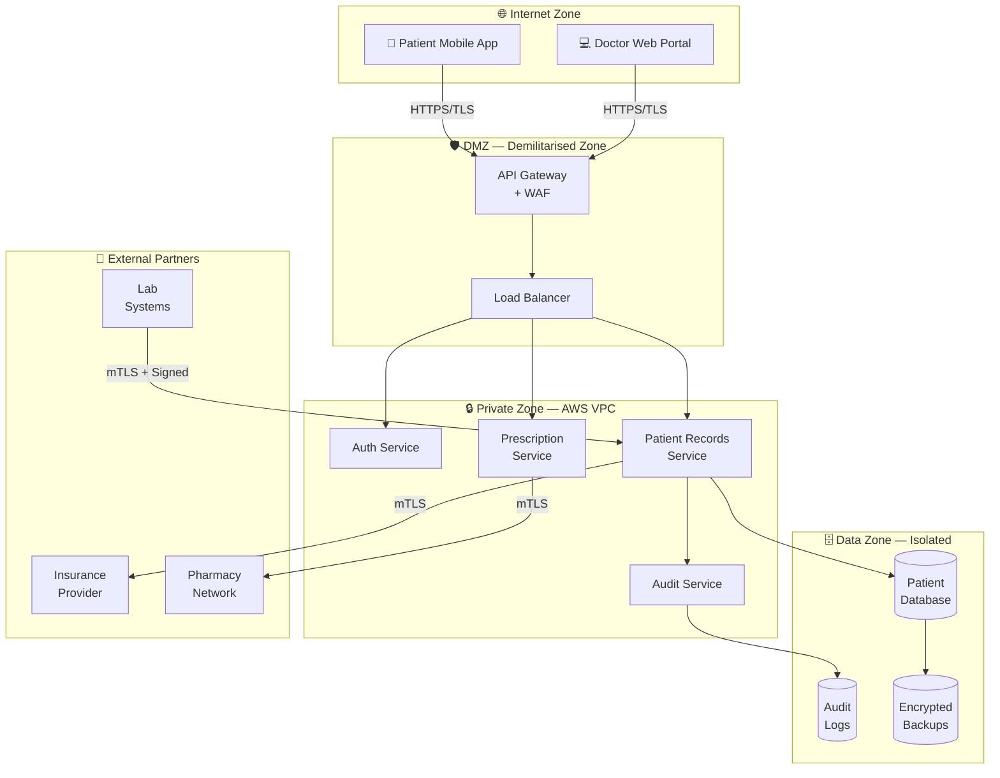
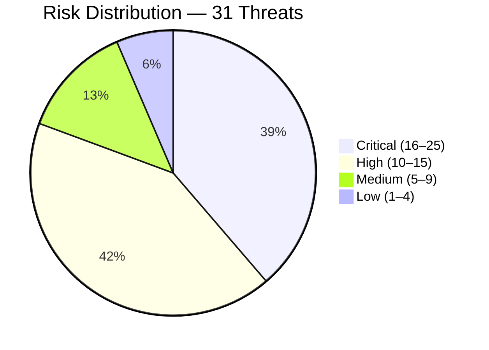
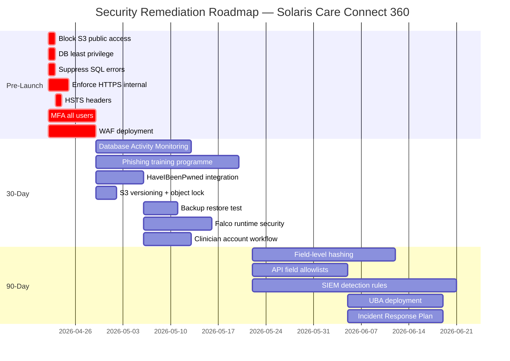

# Threat Model Report
## Solaris Care Connect 360

| Field | Detail |
|-------|--------|
| **Version** | 1.2 |
| **Date** | April 2026 |
| **Classification** | Confidential |
| **Review Cycle** | Quarterly, or upon significant system change |

---

## Executive Summary

Solaris Care Connect 360 is a cloud-based healthcare platform managing the
records, prescriptions, and communications of approximately 100,000 patients
across a network of clinicians, pharmacies, insurance providers, and
diagnostic laboratories.

This threat model was conducted using three industry-standard frameworks:
**STRIDE** (threat categorisation), **MITRE ATT&CK** (real-world technique
mapping), and the **Cyber Kill Chain** (attack narrative modelling). Risk
scores were calculated using a Likelihood × Impact matrix for prioritisation
across all 31 threats, supplemented by DREAD scoring for the five
highest-priority threats where granular component-level analysis was required.
See [Section 4.1](#41-risk-scoring-methodology) for a full explanation of
how the two methods relate.

### Risk Posture at a Glance

| Severity | Count | Status |
|----------|:-----:|--------|
| 🔴 Critical | 12 | Immediate action required — pre-launch blockers |
| 🟠 High | 13 | Must be resolved within 30 days of launch |
| 🟡 Medium | 4 | Must be resolved within 90 days |
| 🟢 Low | 2 | Accept or address when convenient |
| **Total** | **31** | |

### Overall Assessment

> The current security posture is **not production-ready** for a system
> handling Protected Health Information (PHI). Eight pre-launch blockers
> must be resolved before the platform accepts live patient data. The most
> critical gaps are an undeployed Web Application Firewall, absence of
> universal MFA enforcement, and an unaudited S3 backup bucket that may
> be publicly accessible.

> **Note on pre-launch blocker count:** Twelve threats are scored Critical
> by the Likelihood × Impact methodology. The eight pre-launch blockers
> include the highest-scoring Critical threats **plus** High-severity threats
> where remediation effort is low (≤1 week) and the consequence of deferral —
> PHI exposure or undetectable breach — is operationally unacceptable before
> go-live. Resolving high-impact, low-effort gaps pre-launch is standard
> risk management practice regardless of raw score.

### Top 3 Findings

**Finding 1 — SQL Injection (I1) — Risk Score: 20/25 | DREAD: 9.4/10**
The patient records API does not consistently use parameterised queries,
and no Web Application Firewall is deployed. A successful SQL injection
attack would expose the entire patient database and could escalate to
full server compromise. This is the highest-priority vulnerability in
the register.

**Finding 2 — Credential Theft via Phishing (S1) — Risk Score: 16/25 | DREAD: 8.8/10**
MFA is enforced for admin accounts only. Clinical and patient accounts
remain accessible with a password alone. Given that phishing is the
#1 initial access vector in healthcare, this represents an unacceptable
gap for a live system.

**Finding 3 — Exposed Backup Files (I5) — Risk Score: 15/25 | DREAD: 9.8/10**
The S3 backup bucket has not been audited for public access configuration.
An exposed bucket requires zero technical skill to exploit — automated
scanners discover and download public S3 buckets within minutes of
misconfiguration. If exposed, the backup contains the entire patient
database in a single downloadable file.

### Recommended Immediate Actions

| Priority | Action | Effort | Owner |
|----------|--------|--------|-------|
| 1 | Audit and block S3 public access | 1 hour | DevOps |
| 2 | Enforce DB least privilege — app user SELECT-only | 2 hours | DevOps |
| 3 | Suppress SQL errors in production responses | 2 hours | Backend |
| 4 | Enforce MFA for all user accounts | 1 week | Backend |
| 5 | Deploy WAF with SQL injection ruleset | 1 week | DevOps |

### Estimated Remediation Timeline

- **Pre-launch (this sprint):** 8 pre-launch blockers resolved (Critical + High with low remediation effort)
- **30 days post-launch:** Remaining High-priority gaps resolved
- **90 days post-launch:** All remaining medium gaps resolved
- **Total estimated effort:** 10 weeks, 2 engineers

---

## 1. Scope and Methodology

### 1.1 What Was Analysed

| Component | In Scope |
|-----------|----------|
| Patient-facing mobile application (iOS/Android) | ✅ |
| Doctor web portal | ✅ |
| Admin dashboard | ✅ |
| Backend API services | ✅ |
| Database layer (RDS) | ✅ |
| External integrations (Insurance, Pharmacy, Labs) | ✅ |
| Physical security of data centres | ❌ Out of scope |
| Third-party vendor internal security posture | ❌ Out of scope |
| Live penetration testing | ❌ Out of scope |

### 1.2 Methodology

This threat model was produced using four complementary methodologies,
each serving a distinct purpose:

| Methodology | Purpose | Output |
|-------------|---------|--------|
| **STRIDE** | Categorise all threats by type | 31 threats across 6 categories |
| **MITRE ATT&CK** | Map threats to real-world attacker techniques | 21 techniques, 10 tactics covered |
| **Cyber Kill Chain** | Model complete attack narratives (7 stages) | 5 attack scenarios |
| **Likelihood × Impact + DREAD** | Score and rank every threat | Risk register with 31 entries; DREAD deep-dive on top 5 |

### 1.3 Regulatory Context

Solaris Care Connect 360 is a UK-based platform and its **primary regulatory
obligations are UK GDPR and the NHS Data Security and Protection Toolkit
(DSPT)**. UK GDPR is the post-Brexit domestic implementation of the EU GDPR,
enforced by the Information Commissioner's Office (ICO) — not the EU's
supervisory authorities. HIPAA is included in this analysis because the
platform's architecture and data handling practices may in future serve US
patients or US-based partner organisations; however, it is not the primary
compliance driver for the current UK deployment.

| Regulation | Jurisdiction | Enforcer | Primary Obligation | Relevance to This System |
|------------|-------------|----------|-------------------|--------------------------|
| **UK GDPR** | United Kingdom | ICO | Data protection by design; 72-hour breach notification | **Primary** — governs all UK patient PII/PHI |
| **NHS DSPT** | England (NHS) | NHS England | Annual data security self-assessment | **Primary** — required for NHS integration |
| **ISO 27001** | International | Certification body | Information Security Management System | **Primary** — risk register and control framework |
| **HIPAA** | United States | HHS / OCR | Risk analysis of all PHI systems | **Secondary** — applies if US patients are served |
| **EU GDPR** | European Union | Lead SA (varies) | Data protection by design | **Not currently applicable** — UK operates under UK GDPR post-Brexit |

---

## 2. System Overview

### 2.1 Architecture Summary

Solaris Care Connect 360 is a cloud-hosted platform deployed on AWS,
structured across three network zones:

### 2.2 Trust Boundaries

Trust boundaries define where data crosses from a less-trusted to a more-trusted
zone. Each crossing is a potential attack surface.

| Boundary | From | To | Risk |
|----------|------|-----|------|
| TB-1 | Internet | API Gateway | Highest — all external traffic enters here |
| TB-2 | API Gateway | Backend Services | Medium — authenticated but not fully trusted |
| TB-3 | Backend Services | Database | Low — internal VPC only |
| TB-4 | Backend | External APIs | Medium — third-party systems, supply chain risk |

### 2.3 Sensitive Data Flows

| Data Type | Classification | Flows Between | Encryption Required |
|-----------|---------------|---------------|---------------------|
| Patient health records | PHI — Critical | App → API → DB | TLS in transit, AES-256 at rest |
| Login credentials | PII — High | App → Auth Service | TLS in transit, bcrypt at rest |
| Prescription data | PHI — Critical | Doctor → Rx → Pharmacy | mTLS |
| Lab results | PHI — Critical | Lab → API → Records | mTLS + cryptographic signing |
| Insurance claims | Financial — High | API → Insurance | mTLS |
| Session tokens | Sensitive | App → All Services | TLS, JWT signed |
| Audit logs | Internal | All Services → Audit DB | TLS in transit, encrypted at rest |

---

## 3. Threat Analysis

### 3.1 STRIDE Overview

STRIDE is a structured methodology for categorising security threats.
Each letter represents a different type of attack:

| Letter | Threat Type | Definition | Healthcare Example |
|--------|------------|------------|-------------------|
| **S** | Spoofing | Impersonating a legitimate user or system | Attacker creates a fake doctor account |
| **T** | Tampering | Maliciously modifying data | Attacker alters a prescription dosage |
| **R** | Repudiation | Denying an action was taken | Doctor denies approving a prescription |
| **I** | Information Disclosure | Exposing data to unauthorised parties | Patient database leaked via SQL injection |
| **D** | Denial of Service | Making a system unavailable | DDoS attack takes down patient portal |
| **E** | Elevation of Privilege | Gaining more access than authorised | Patient account gains doctor-level access |

### 3.2 STRIDE Threat Summary

> **Note on scope:** 31 threats are carried forward to the risk register and
> scored. The per-category counts below reflect the full enumeration; threats
> marked as out-of-scope for the current architecture (physical access,
> third-party internal posture) are excluded from risk scoring.

| Category | Threats Identified | 🔴 Critical | 🟠 High | 🟡 Medium | 🟢 Low |
|----------|:-----------------:|:-----------:|:-------:|:---------:|:------:|
| Spoofing | 5 | 2 | 2 | 1 | 0 |
| Tampering | 5 | 3 | 2 | 0 | 0 |
| Repudiation | 5 | 0 | 2 | 2 | 1 |
| Information Disclosure | 6 | 4 | 2 | 0 | 0 |
| Denial of Service | 5 | 0 | 3 | 0 | 2 |
| Elevation of Privilege | 5 | 3 | 2 | 0 | 0 |
| **Total** | **31** | **12** | **13** | **3** | **3** |

### 3.3 MITRE ATT&CK Coverage

MITRE ATT&CK maps each STRIDE threat to the specific real-world technique
an attacker would use to execute it. This grounds the threat model in
documented attacker behaviour rather than theoretical risk.

**Tactic coverage achieved: 10 of 12 (83%)**

| Tactic | Threats Mapped | Status |
|--------|:--------------:|--------|
| Initial Access | S1, S5, I1 | ✅ |
| Execution | Ransomware chain | ✅ |
| Persistence | S2, R1 | ✅ |
| Privilege Escalation | E1, E3, E4, E5 | ✅ |
| Defense Evasion | T3, R1 | ✅ |
| Credential Access | S3, S4, I4, D4 | ✅ |
| Discovery | Kill Chain 1 | ✅ |
| Collection | R5, I2, I5 | ✅ |
| Exfiltration | Kill Chains 1, 2 | ✅ |
| Impact | T1, T2, T5, D1 | ✅ |
| Lateral Movement | Not yet mapped | ⚠️ Gap |
| Command & Control | Not yet mapped | ⚠️ Gap |

The two gaps (Lateral Movement, Command & Control) are low-risk in the
current architecture due to network segmentation and strict outbound
firewall rules, and will be addressed in the next threat model iteration.

### 3.4 Kill Chain Analysis Summary

Five attack scenarios were modelled using the Lockheed Martin Cyber Kill
Chain framework, showing how an attacker progresses through 7 stages from
initial reconnaissance to final impact.

| Scenario | Entry Point | Final Impact | Chain Broken? |
|----------|------------|--------------|---------------|
| Ransomware via phishing | HR email | DB encryption | ✅ Broken at Stage 3 |
| Insider threat — rogue doctor | Valid credentials | PHI exfiltration | ⚠️ Partially broken |
| SQL injection — DB compromise | Patient API | Full DB access | ✅ Broken at Stage 4 |
| Supply chain via lab feed | Lab integration | False diagnoses | ⚠️ Partially broken |
| Credential stuffing | Login portal | Account takeover | ✅ Broken at Stage 4 |

---

## 4. Risk Assessment

### 4.1 Risk Scoring Methodology

This threat model uses **two complementary scoring methods** applied at
different levels of depth. They are not redundant — they serve different
audiences and answer different questions.

#### Why Two Methods?

| Method | Audience | Question Answered | Applied To |
|--------|----------|------------------|------------|
| **Likelihood × Impact (L×I)** | Executive, governance, programme management | *Which threats matter most and in what order?* | All 31 threats |
| **DREAD** | Security engineers, developers, red team | *How technically exploitable is this specific vulnerability?* | Top 5 threats only |

L×I is fast, consistent, and easy to communicate to non-technical
stakeholders. DREAD provides component-level granularity — breaking
exploitability into five dimensions — for the highest-priority threats
where engineering decisions depend on that detail.

#### Likelihood × Impact (L×I)

Every threat is scored using the formula:

> **Risk Score = Likelihood (1–5) × Impact (1–5) = Score (1–25)**

| Score | Priority | Required Response |
|-------|----------|------------------|
| 16–25 | 🔴 Critical | Resolve before system launch |
| 10–15 | 🟠 High | Resolve within 30 days |
| 5–9 | 🟡 Medium | Resolve within 90 days |
| 1–4 | 🟢 Low | Accept or address when convenient |

#### DREAD

DREAD scores each threat across five dimensions, each rated 1–10:

| Dimension | Question |
|-----------|----------|
| **D** — Damage | How severe is the damage if exploited? |
| **R** — Reproducibility | How easily can the attack be reproduced? |
| **E** — Exploitability | How much skill or effort does exploitation require? |
| **A** — Affected Users | What proportion of users are impacted? |
| **Di** — Discoverability | How easy is it for an attacker to find this vulnerability? |

> **DREAD Score = (D + R + E + A + Di) ÷ 5**

#### Scoring Bridge — Top 5 Threats (Both Methods)

The table below shows how the two scoring methods relate for the five
highest-priority threats. A high L×I score reflects strategic business
risk; a high DREAD score reflects technical exploitability. Both are
relevant — a threat that is easy to exploit *and* carries high business
impact is always the most urgent priority.

| Threat | L×I Score | L×I Priority | DREAD Score | DREAD Interpretation | Consistent? |
|--------|:---------:|:------------:|:-----------:|---------------------|:-----------:|
| SQL Injection — PHI Breach (I1) | 20/25 | 🔴 Critical | 9.4/10 | Trivial to exploit, entire DB at risk | ✅ Yes |
| Exposed Backup Files (I5) | 15/25 | 🟠 High | 9.8/10 | Zero skill required, automated discovery | ⚠️ DREAD higher¹ |
| Credential Stuffing (S3) | 14/25 | 🟠 High | 8.8/10 | No MFA, tools freely available | ✅ Yes |
| Insider Bulk Export (E2) | 12/25 | 🟠 High | 8.6/10 | Valid credentials, no UBA detection | ✅ Yes |
| Ransomware via Phishing (T5) | 12/25 | 🟠 High | 8.4/10 | Commodity tooling, wide attack surface | ✅ Yes |

> **¹ Note on I5 (Exposed Backup Files):** DREAD scores this higher than L×I
> because the Likelihood score (3/5) reflects that the misconfiguration
> *may not* be present — it has not yet been confirmed. If confirmed exposed,
> the L×I score would rise to 25/25 (Critical). The DREAD score captures
> the near-zero exploitability barrier if the misconfiguration exists.
> This is an intentional methodological difference, not an error.

#### When to Use Each Score

- **Use L×I scores** when communicating with executives, writing risk
  registers, or comparing threats for prioritisation.
- **Use DREAD scores** when briefing engineering teams, writing remediation
  tickets, or assessing whether a specific fix changes the exploitability
  profile of a vulnerability.

---

### 4.2 Risk Matrix

|  | **Impact 1** | **Impact 2** | **Impact 3** | **Impact 4** | **Impact 5** |
|--|:---:|:---:|:---:|:---:|:---:|
| **Likelihood 5** | 5 🟡 | 10 🟠 | 15 🟠 | 20 🔴 | 25 🔴 |
| **Likelihood 4** | 4 🟢 | 8 🟡 | 12 🟠 | 16 🔴 | 20 🔴 |
| **Likelihood 3** | 3 🟢 | 6 🟡 | 9 🟡 | 12 🟠 | 15 🟠 |
| **Likelihood 2** | 2 🟢 | 4 🟢 | 6 🟡 | 8 🟡 | 10 🟠 |
| **Likelihood 1** | 1 🟢 | 2 🟢 | 3 🟢 | 4 🟢 | 5 🟡 |

### 4.3 Top 10 Scored Risks

| Rank | ID | Threat | Likelihood | Impact | L×I Score | DREAD Score | Priority |
|------|----|--------|:----------:|:------:|:---------:|:-----------:|----------|
| 1 | I1 | SQL Injection — PHI Breach | 4 | 5 | **20** | **9.4** | 🔴 Critical |
| 2 | S1 | Credential Theft via Phishing | 4 | 4 | **16** | **8.8** | 🔴 Critical |
| 3 | E4 | Container Escape to Host | 3 | 5 | **15** | — | 🟠 High |
| 3 | E3 | SQLi → DBA Access | 3 | 5 | **15** | — | 🟠 High |
| 3 | I4 | Unencrypted Data in Transit | 3 | 5 | **15** | — | 🟠 High |
| 3 | I5 | Exposed Backup Files | 3 | 5 | **15** | **9.8** | 🟠 High |
| 3 | S2 | Fake Doctor Accounts | 3 | 5 | **15** | — | 🟠 High |
| 8 | E1 | Patient → Doctor Privilege | 3 | 4 | **12** | — | 🟠 High |
| 8 | T1 | Patient Record Modification | 3 | 4 | **12** | — | 🟠 High |
| 8 | I2 | Excessive Data Return | 4 | 3 | **12** | — | 🟠 High |

> DREAD scores are provided for the top 5 threats where engineering-level
> exploitability analysis was performed. — indicates L×I scoring only.

### 4.4 Risk Distribution

---

## 5. Security Control Analysis

### 5.1 Control Coverage Summary

Controls are categorised as Preventive (stop attacks), Detective (identify
attacks), or Corrective (recover from attacks).

Current implementation status across all mapped controls:

| NIST Function | Controls Mapped | ✅ Implemented | 🟡 Partial | ❌ Missing |
|---------------|:--------------:|:-------------:|:---------:|:---------:|
| Identify | 3 | 1 | 1 | 1 |
| Protect | 28 | 4 | 11 | 13 |
| Detect | 16 | 2 | 3 | 11 |
| Respond | 3 | 0 | 1 | 2 |
| Recover | 3 | 0 | 1 | 2 |
| **Total** | **53** | **7 (13%)** | **17 (32%)** | **29 (55%)** |

The Detect, Respond, and Recover functions are critically under-implemented.
A system that prevents attacks but cannot detect or recover from them
does not meet UK GDPR or NHS DSPT security requirements.

### 5.2 Critical Control Gaps

| Gap | Affected Risk | Missing Control | Effort |
|-----|--------------|----------------|--------|
| GAP-1 | I1 | Web Application Firewall | Medium |
| GAP-2 | I1 | SQL error suppression in production | Low |
| GAP-3 | I1 | Database Activity Monitoring | High |
| GAP-4 | I1, E3 | DB least privilege (SELECT-only app user) | Low |
| GAP-5 | S1 | MFA enforced for all users | Medium |
| GAP-6 | S1 | Security awareness training programme | Low |
| GAP-7 | S1 | Credential breach monitoring | Low |
| GAP-8 | I4 | HTTPS on all internal service calls | Medium |
| GAP-9 | I4 | HSTS headers configured | Low |
| GAP-10 | I5 | S3 backup bucket public access blocked | Low |

**Full gap register (18 gaps) available in:** [`reports/analyses/security-control-mapping.md`](reports/analyses/security-control-mapping.md)

---

## 6. Recommendations

### 6.1 Pre-Launch — Must Fix Before Go-Live

These eight actions must be completed before the platform accepts live patient
PHI. They comprise the highest-scoring Critical threats plus High-scored threats
where remediation effort is low (≤1 week) and deferral risk is operationally
unacceptable — consistent with standard risk-based pre-launch decision-making.

| # | Action | Gap | Severity | Owner | Estimated Effort |
|---|--------|-----|----------|-------|-----------------|
| 1 | Block S3 public access on backup bucket | GAP-10 | 🟠 High | DevOps | 1 hour |
| 2 | Set DB app user to SELECT privilege only | GAP-4 | 🟠 High | DevOps | 2 hours |
| 3 | Suppress SQL error messages in production | GAP-2 | 🟠 High | Backend | 2 hours |
| 4 | Enforce HTTPS on all internal services | GAP-8 | 🟠 High | DevOps | 1 day |
| 5 | Configure HSTS headers | GAP-9 | 🟠 High | Backend | 2 hours |
| 6 | Verify S3 backup encryption (AES-256) | GAP-10 | 🟠 High | DevOps | 2 hours |
| 7 | Enforce MFA for all user account types | GAP-5 | 🔴 Critical | Backend | 1 week |
| 8 | Deploy WAF with SQL injection ruleset | GAP-1 | 🔴 Critical | DevOps | 1 week |

### 6.2 Short-Term — Within 30 Days

| # | Action | Gap | Owner | Priority |
|---|--------|-----|-------|----------|
| 9 | Deploy Database Activity Monitoring | GAP-3 | DevOps | 🟠 High |
| 10 | Launch phishing simulation programme | GAP-6 | Security | 🟠 High |
| 11 | Integrate HaveIBeenPwned credential monitoring | GAP-7 | Backend | 🟠 High |
| 12 | Enable S3 versioning and object lock | GAP-11 | DevOps | 🟠 High |
| 13 | Test backup restore end-to-end | GAP-12 | DevOps | 🟠 High |
| 14 | Disable dangerous DB stored procedures | GAP-13 | DevOps | 🟠 High |
| 15 | Deploy Falco container runtime security | GAP-15 | DevOps | 🟠 High |
| 16 | Implement clinician account approval workflow | GAP-16 | Backend | 🟠 High |
| 17 | Set containers to read-only filesystem | GAP-14 | DevOps | 🟠 High |

### 6.3 Medium-Term — Within 90 Days

| # | Action | Owner | Priority |
|---|--------|-------|----------|
| 18 | Field-level integrity hashing on patient records | Backend | 🟡 Medium |
| 19 | API field allowlists on all endpoints | Backend | 🟡 Medium |
| 20 | SIEM detection rules for all STRIDE threats | Security | 🟡 Medium |
| 21 | Deploy User Behaviour Analytics (UBA) | DevOps | 🟡 Medium |
| 22 | Establish quarterly RBAC access review process | Security | 🟡 Medium |
| 23 | Develop and test Incident Response Plan | Security | 🟡 Medium |
| 24 | Conduct third-party vendor security assessment | Security | 🟡 Medium |

### 6.4 Implementation Roadmap

---

## 7. Compliance Mapping

This section maps key recommendations to the regulatory controls they satisfy.

| Recommendation | UK GDPR | HIPAA | NIST CSF | ISO 27001 |
|----------------|:-------:|:-----:|:--------:|:---------:|
| MFA for all users | Art. 32 | §164.312(d) | PR.AC-7 | A.9.4.2 |
| PHI encryption at rest | Art. 32 | §164.312(a)(2)(iv) | PR.DS-1 | A.10.1.1 |
| PHI encryption in transit | Art. 32 | §164.312(e)(2)(ii) | PR.DS-2 | A.10.1.1 |
| Audit logging | Art. 30 | §164.312(b) | DE.CM-3 | A.12.4.1 |
| Access control (RBAC) | Art. 25 | §164.312(a)(1) | PR.AC-4 | A.9.1.2 |
| Risk assessment (this document) | Art. 35 (DPIA) | §164.308(a)(1) | ID.RA-1 | A.12.6.1 |
| Backup and recovery | Art. 32(1)(c) | §164.308(a)(7) | RC.RP-1 | A.12.3.1 |
| Incident response plan | Art. 33 | §164.308(a)(6) | RS.RP-1 | A.16.1.1 |
| **ICO breach notification** | **Art. 33 — 72 hrs** | — | RS.CO-2 | A.16.1.3 |

### 7.1 UK GDPR Breach Notification Obligations (ICO — Article 33)

Under **UK GDPR Article 33**, Solaris Care Connect 360 is legally required
to notify the Information Commissioner's Office (ICO) of any personal data
breach within **72 hours** of becoming aware of it — if the breach is likely
to result in a risk to the rights and freedoms of individuals. Given that
this system processes special category health data (the highest protection
tier under UK GDPR), **virtually every security breach in this threat
register would trigger mandatory ICO notification.**

#### What Triggers Notification?

A breach must be reported to the ICO if it is likely to result in risk to
individuals. For a healthcare platform handling special category data, the
ICO considers the following to *always* constitute high risk:

- Unauthorised access to or exfiltration of patient health records
- Loss of availability of systems holding patient data (e.g. ransomware)
- Exposure of patient data to an unintended recipient
- Destruction or corruption of patient records without backup recovery

#### The 72-Hour Clock

| Stage | Requirement | Detail |
|-------|-------------|--------|
| **Hour 0** | Breach detected | Clock starts from when *any* staff member becomes aware |
| **Hour 0–72** | Notify ICO | Report via ICO online portal even if investigation is incomplete |
| **Hour 0–72** | Internal escalation | DPO (or equivalent) must be notified immediately |
| **Without undue delay** | Notify affected individuals | Required if breach is *high risk* to those individuals |
| **Ongoing** | Document everything | All breaches must be recorded internally, even if not reported |

> **Key point:** The 72-hour deadline is not 72 hours from *confirming* the
> breach — it is 72 hours from *becoming aware* that a breach may have
> occurred. Investigations do not pause the clock. Partial notifications
> are accepted; the ICO can be updated as more information becomes available.

#### What Must Be Included in the ICO Notification?

Per UK GDPR Article 33(3), the notification must contain:

1. The **nature** of the breach (categories and approximate number of individuals and records affected)
2. The **name and contact details** of the Data Protection Officer (DPO)
3. The **likely consequences** of the breach
4. The **measures taken or proposed** to address the breach and mitigate its effects

#### Threat-to-Notification Mapping

The following threats in this register would trigger mandatory ICO notification
if successfully exploited:

| Threat ID | Threat | Notification Trigger | Notification Urgency |
|-----------|--------|---------------------|---------------------|
| I1 | SQL Injection — PHI Breach | Mass patient record exfiltration | 🔴 Immediate — entire DB at risk |
| I5 | Exposed Backup Files | Public exposure of full patient DB backup | 🔴 Immediate — 100,000 patients |
| S1 | Credential Theft via Phishing | Clinician account compromise → PHI access | 🟠 Within 24 hrs of confirmation |
| S3 | Token Forgery | Patient account takeover → PHI access | 🟠 Within 24 hrs of confirmation |
| T1 | Patient Record Modification | Integrity breach of health records | 🟠 Within 24 hrs of confirmation |
| T5 | Vitals Data Tampering | Availability loss + potential exfiltration | 🔴 Immediate — dual notification likely |
| E2 | Doctor → Admin Privilege | Deliberate exfiltration by authorised user | 🟠 Within 24 hrs of confirmation |
| I3 | Verbose Error Messages | PHI shared with unauthorised external party | 🟠 Within 24 hrs of confirmation |

#### Operational Readiness Gap

**This system currently has no documented Incident Response Plan (IRP).**
Without an IRP, the organisation cannot reliably meet the 72-hour
notification deadline. Recommendation 23 (Develop and test Incident
Response Plan) in Section 6.3 directly addresses this gap and should
be treated as a compliance obligation, not merely a best practice.

The IRP must include, at minimum:
- A named DPO or privacy lead with ICO notification authority
- A breach assessment checklist (does this trigger Art. 33 notification?)
- An ICO notification template pre-populated with system details
- An internal escalation path from detection → DPO → ICO within 4 hours

#### Penalty for Non-Compliance

Failure to notify the ICO within 72 hours, without demonstrable justification,
can result in fines of up to **£17.5 million or 4% of global annual turnover**
(whichever is higher) under UK GDPR. For a healthcare platform, reputational
damage and regulatory investigation are likely to accompany any financial
penalty.

---

## Appendices

| Appendix | Document | Contents |
|----------|----------|---------|
| A | [`reports/analyses/stride-threats.md`](reports/analyses/stride-threats.md) | All 31 STRIDE threats, full register |
| B | [`reports/analyses/mitre-mapping.md`](reports/analyses/mitre-mapping.md) | MITRE ATT&CK mapping, 5 attack chains |
| C | [`reports/analyses/kill-chain-analysis.md`](reports/analyses/kill-chain-analysis.md) | 5 kill chain scenarios with controls |
| D | [`reports/analyses/risk-register.md`](reports/analyses/risk-register.md) | Full risk register with DREAD scores |
| E | [`reports/analyses/security-control-mapping.md`](reports/analyses/security-control-mapping.md) | 53 controls mapped, 18 gaps identified |
| F | [`diagrams/architecture.md`](../diagrams/architecture.md) | System architecture diagram |
| G | [`diagrams/dfd-level0.md`](../diagrams/dfd-level0.md) | Level 0 data flow diagram |
| H | [`diagrams/dfd-level1.md`](../diagrams/dfd-level1.md) | Level 1 data flow diagram |

---

*This threat model should be reviewed quarterly or upon any significant
change to system architecture, data flows, or the external threat landscape.
The next scheduled review is July 2026.*
